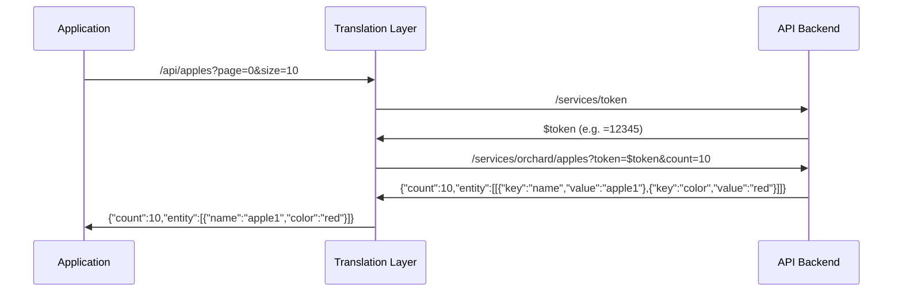
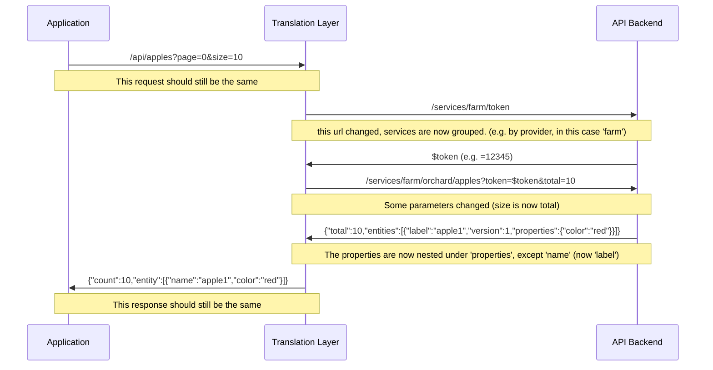

# api-migration-example

demonstrate potential changes for data migration in an api

This repository shows what an api migration might look like in code for
situations where the api is abstracted away by the use of a separate
microservice that simply converts one api contract to another. Imagine
starting with something like this:

and ending up with something like this:

There are several changes in here, urls, parameters, and output format, which
will be dealt with by the translation layer so the main application doesn't
have to.
